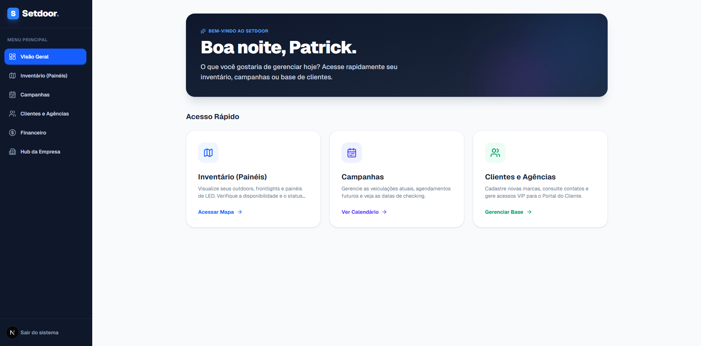
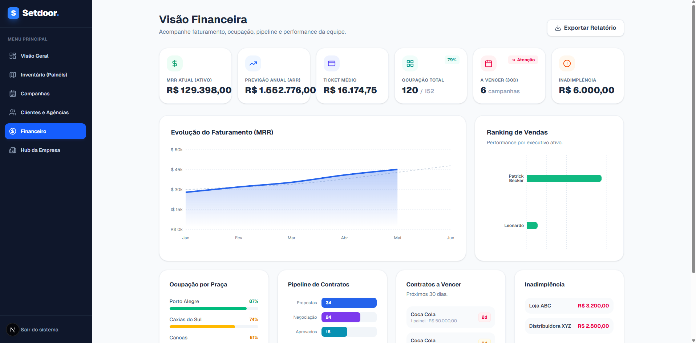
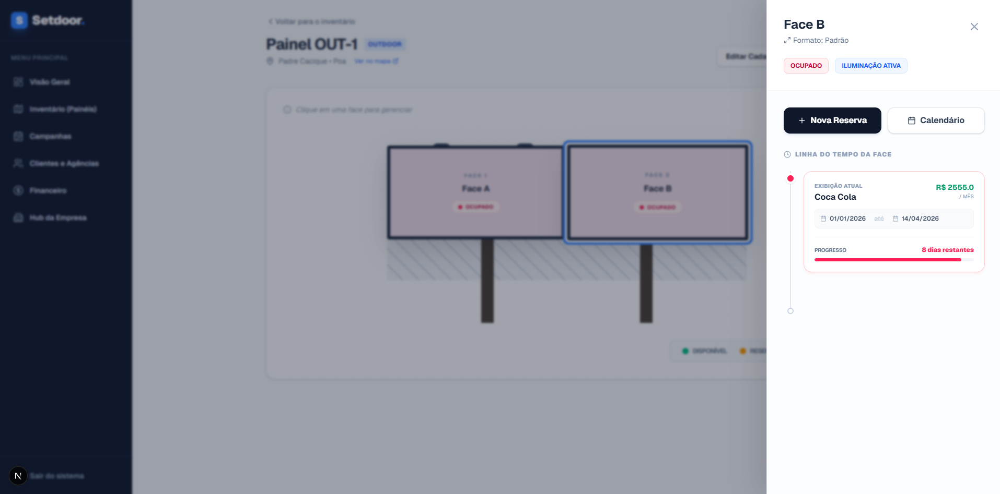
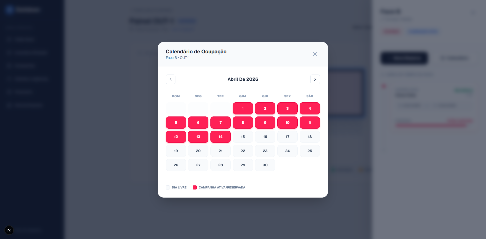
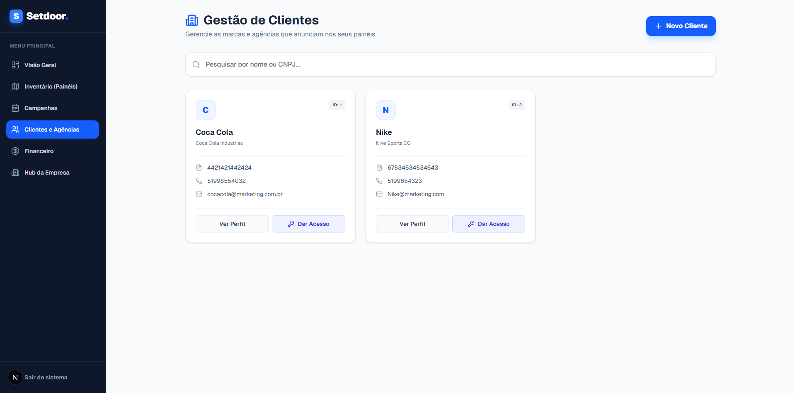
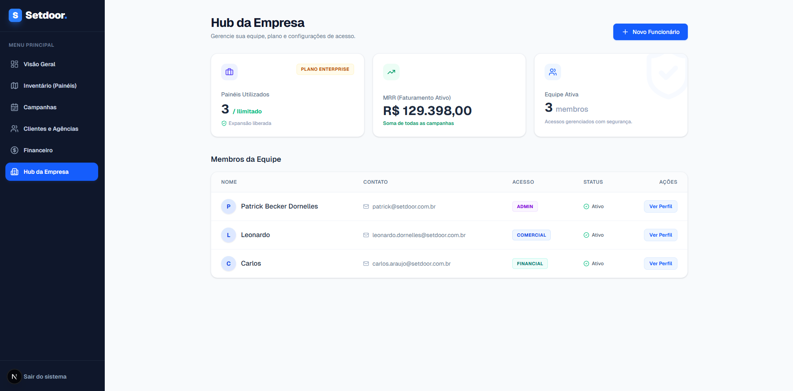
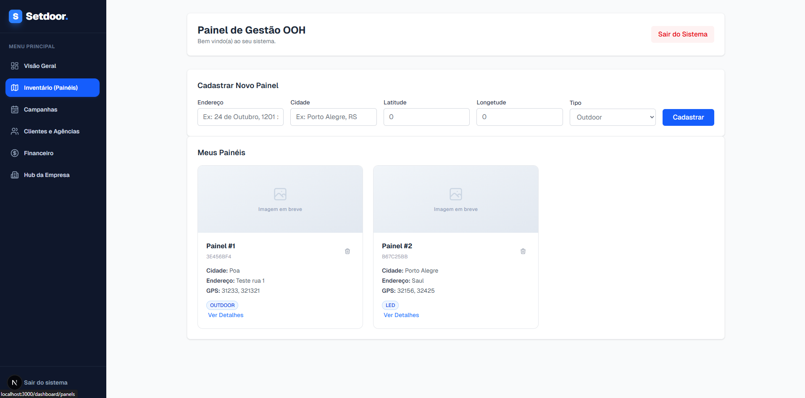
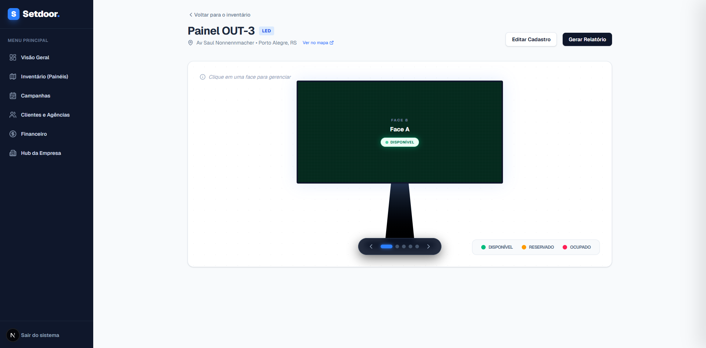

<div align="center">

# 🖥️ Setdoor — Frontend

**Painel de controle para empresas de mídia Out-of-Home (OOH)**

Mapa interativo de inventário, funil comercial, calendário de ocupação e dashboard financeiro em uma única interface.

[](https://nextjs.org/)
[](https://react.dev/)
[](https://www.typescriptlang.org/)
[](https://tailwindcss.com/)
[](https://recharts.org/)
[](https://leafletjs.com/)

[⚙️ Backend (Spring Boot)](https://github.com/leonardondornelles/saasooh-backend) · [Funcionalidades](#-funcionalidades) · [Stack](#-stack-tecnológica) · [Como rodar](#-como-rodar-localmente)

</div>

---

## 📖 Sobre o projeto

**Setdoor** é a interface web de um SaaS B2B para empresas de **mídia Out-of-Home** — outdoors, front lights, triedros, telas de LED e painéis de rodovia — gerenciarem inventário, campanhas, clientes e faturamento em um único painel.

O projeto nasceu de um problema real: a empresas de mídia exterior controlam tudo isso em planilhas. Este frontend consome a [API REST em Spring Boot](https://github.com/leonardondornelles/saasooh-backend) que construí em paralelo, e foi pensado para ser a ferramenta de trabalho diário de quem vende e opera painéis publicitários: do mapa de disponibilidade até o funil de vendas e a saúde financeira da operação.

---

## 📸 Screenshots

| Visão Geral | Dashboard Financeiro |
|---|---|
|  |  |

| Detalhe do Painel (faces + timeline) | Calendário de Ocupação |
|---|---|
|  |  |

| Gestão de Clientes | Hub da Empresa |
|---|---|
|  |  |

| Inventário com mapa | Painel de LED |
|---|---|
|  |  |

---

## ✨ Funcionalidades

### 🏠 Landing page
Página institucional pública (`/`) com seções de recursos, planos (Basic / Pro / Enterprise com preços) e CTAs para registro — o botão de cada plano já pré-preenche o formulário de cadastro via query string (`/register?plan=PRO`).

### 📊 Visão Geral
Saudação personalizada por horário (bom dia / boa tarde / boa noite) com o nome do usuário autenticado, e atalhos rápidos para Inventário, Campanhas e Clientes.

### 🗺️ Inventário de Painéis
- Cadastro de painéis (endereço, cidade, coordenadas GPS, tipo, iluminação)
- **Mapa interativo com Leaflet/OpenStreetMap**: cada painel aparece como marcador geolocalizado, com popup mostrando tipo, cidade, faces disponíveis e atalho direto para a página do painel; o mapa ajusta zoom e bounds automaticamente aos painéis filtrados
- Listagem em cards com tipo, código de identificação e localização
- Página de detalhe com representação visual interativa das faces por tipo de painel (Outdoor com 2 faces, LED com até 5, Empena com 1, etc.)
- Clique na face abre uma sidebar com status (ocupado / disponível / reservado), cliente atual, valor mensal, datas de início/fim e barra de progresso da campanha
- Ações rápidas: Nova Reserva e Calendário por face

### 📆 Calendário de Ocupação
- Modal de calendário mensal por face da campanha
- Dias marcados conforme status da campanha (ativa/reservada vs. disponível)
- Navegação entre meses

### 🧾 Hub de Campanhas (Funil Comercial)
- Tabela central com todas as campanhas da empresa: cliente, painel/face, período, investimento e estágio do funil
- Filtro por status (Proposta, Negociação, Aprovado, Reservado, Ativo, Concluído, Perdido, Cancelado) e busca textual
- Criação de campanha com seleção em cascata (painel → faces disponíveis daquele painel)
- Atualização de status via modal, respeitando as mesmas regras de negócio do backend (não é possível retroceder uma campanha já ativa para fases de negociação)
- Atalho direto para o painel de onde a campanha está sendo veiculada

### 💰 Dashboard Financeiro
Área restrita aos perfis `ADMIN` e `FINANCIAL`:
- KPIs: MRR ativo, ARR projetado, ticket médio, ocupação total, contratos a vencer (30 dias) e inadimplência
- Gráfico de área (Recharts): faturamento real vs. projetado, mês a mês
- Ranking de executivos por volume de vendas (gráfico de barras horizontal)
- Ocupação por praça/cidade, com barra de progresso e indicadores por faixa de percentual
- Funil de pipeline (propostas → negociação → aprovados)
- Alertas de contratos vencendo, com nível de urgência sinalizado por cor
- Painel de inadimplência com clientes e valores em aberto

### 🧑‍🤝‍🧑 Clientes e Agências
- Cards com nome fantasia, razão social, CNPJ, telefone e e-mail
- Busca por nome ou CNPJ
- Perfil do cliente com receita total, ticket médio e histórico de campanhas
- Ação para conceder acesso ao portal do cliente (planos PRO/ENTERPRISE)

### 🏢 Hub da Empresa
- Plano SaaS ativo com limite de painéis (BASIC / PRO / ENTERPRISE)
- KPIs: painéis utilizados, MRR total da empresa e tamanho da equipe
- Tabela de membros com cargo (Administrador, Comercial, Financeiro) e status
- Formulário de cadastro de novos colaboradores, restrito a usuários `ADMIN`

### 🧾 Faturas *(em desenvolvimento)*
Tela de faturas com listagem, busca, e modal de registro de pagamento (PIX, entre outros métodos) já implementada na interface — a integração completa com o backend (endpoint de invoices) ainda está em construção, por isso a seção não aparece no menu lateral por padrão.

---

## 🛠️ Stack Tecnológica

| Camada | Tecnologia |
|---|---|
| Framework | Next.js 16 (App Router) + React 19 |
| Linguagem | TypeScript |
| Estilo | Tailwind CSS v4 |
| Gráficos | Recharts (área, barras) |
| Mapas | Leaflet + React-Leaflet (tiles OpenStreetMap) |
| Ícones | Lucide React |
| HTTP | Axios, com interceptor de autenticação |
| Autenticação | JWT armazenado em cookie (`saas_token`), lido em cada request |
| Proteção de rotas | Middleware do Next.js (`src/middleware.ts`) |

---

## 📁 Estrutura do Projeto

```
src/
├── app/
│   ├── page.tsx              # Landing page pública
│   ├── login/                # Tela de login
│   ├── register/             # Registro de novo tenant (com plano pré-selecionado por query string)
│   └── dashboard/
│       ├── page.tsx          # Visão geral
│       ├── layout.tsx        # Sidebar, menu dinâmico por role, logout
│       ├── panels/           # Inventário de painéis + mapa Leaflet
│       ├── panel/[id]/       # Detalhe do painel, faces e campanhas
│       ├── campaigns/        # Hub de campanhas (funil comercial)
│       ├── customers/        # Clientes e agências
│       ├── customers/[id]/   # Perfil do cliente
│       ├── finance/          # Dashboard financeiro (ADMIN / FINANCIAL)
│       ├── invoices/         # Faturas (em desenvolvimento)
│       ├── team/[id]/        # Perfil de colaborador
│       └── company/          # Hub da empresa (apenas ADMIN)
├── components/
│   └── MapComponent.tsx      # Mapa Leaflet reutilizável, com marcadores e auto-fit de bounds
├── services/
│   └── api.ts                 # Instância Axios com interceptor de JWT
└── middleware.ts               # Protege /dashboard/* e redireciona usuários já logados
```

---

## 🔐 Autenticação e controle de acesso

- O token JWT retornado pelo backend é salvo no cookie `saas_token`
- Um interceptor do Axios injeta o header `Authorization: Bearer <token>` em toda chamada à API
- O `middleware.ts` do Next.js bloqueia acesso a `/dashboard/*` sem token (redireciona para a landing) e redireciona usuários já autenticados para longe de `/`
- O menu lateral é montado dinamicamente conforme o `role` do usuário retornado por `/api/users/me`: apenas `ADMIN` vê "Hub da Empresa"; `ADMIN` e `FINANCIAL` veem "Financeiro"

---

## 🚀 Como rodar localmente

### Pré-requisitos
- Node.js 18+
- [Backend (Spring Boot)](https://github.com/leonardondornelles/saasooh-backend) rodando em `http://localhost:8080`

### 1. Clone o repositório
```bash
git clone https://github.com/leonardondornelles/saasooh-frontend.git
cd saasooh-frontend
```

### 2. Instale as dependências
```bash
npm install
# ou
pnpm install
```

### 3. Execute
```bash
npm run dev
```

Acesse `http://localhost:3000`.

> ℹ️ A URL da API atualmente está fixa em `src/services/api.ts` (`http://localhost:8080`). Para apontar para outro ambiente, ajuste esse valor ou — como planejado no roadmap — migre para uma variável de ambiente (`NEXT_PUBLIC_API_URL`).

---

## 🗺️ Roadmap

- [ ] Mover a URL base da API para variável de ambiente (`NEXT_PUBLIC_API_URL`)
- [ ] Concluir a integração do módulo de Faturas com o backend e adicioná-lo ao menu lateral
- [ ] Geração de propostas comerciais em PDF direto da tela de campanhas
- [ ] Testes de componentes (React Testing Library) para os fluxos críticos (criação de campanha, mapa de painéis)
- [ ] Internacionalização (hoje toda a interface está em pt-BR, incluindo os valores do enum de status vindos do backend)

---

## 👨‍💻 Autor

**Leonardo Noronha Dornelles**
Estudante de Ciência da Computação — PUCRS

[GitHub](https://github.com/leonardondornelles) · [LinkedIn](https://www.linkedin.com/in/leonardo-noronha-dornelles-3a7151324/)
